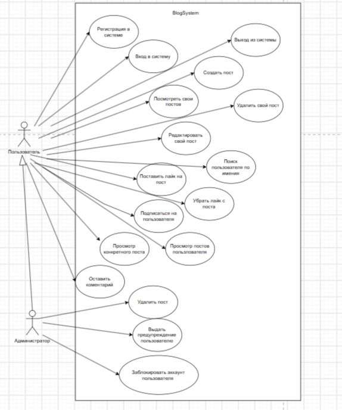
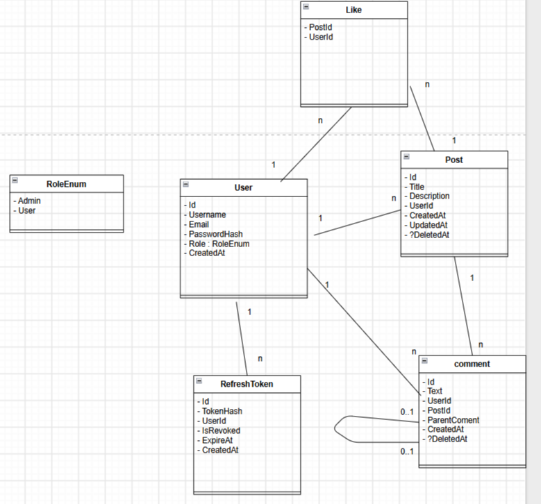

# Blog
Создание бэкенда для Блога в котором будут пользователи. Каждый пользователь может вести свой блог, иметь подписчиков. Каждый пост будет иметь автора, число лайков. Также будет администратор, который сможет модерировать посты.
Вся система в общем будет описываться следующими диаграммами
### Диаграмма прецедентов

### Диаграмма "классов"
